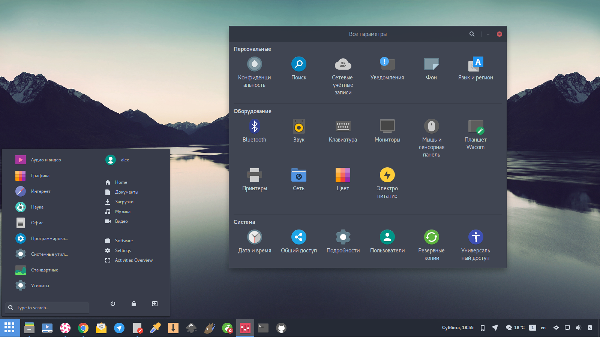

# ubuntu-after-install
Ubuntu after install script for Gnome with [Arc Dark GTK Theme](https://github.com/horst3180/arc-theme) and [Papirus Dark Icon Theme](https://github.com/PapirusDevelopmentTeam/papirus-icon-theme)

# usage
[Download](https://raw.githubusercontent.com/varlesh/ubuntu-after-install/master/run.sh) and run.
